# flutter-template

GitHub Template repository. Every new Flutter project starts from here.

> **Blank canvas.** No `lib/`, no `pubspec.yaml`, no Flutter code.
> The template provides the developer toolchain, the git hooks, the CI/CD and the
> repository governance only. You initialise Flutter yourself inside the container.

[](https://github.com/alihaidar0/flutter-template/actions/workflows/ci.yml)
[](https://github.com/alihaidar0/flutter-template/actions/workflows/build.yml)
[](LICENSE)

This README is the complete guide: how to create a new app from the template and
run it for the first time, how git and the hooks behave inside and outside the
container, how branches, CI, builds and releases work, and which repository
settings a new repository needs. Placeholders (`OWNER`, `my_app`,
`com.yourcompany`) are yours to replace.

## Contents

1. [What this template is](#1-what-this-template-is)
2. [Create a new app — from zero to the first run](#2-create-a-new-app--from-zero-to-the-first-run)
3. [Set up the GitHub repository](#3-set-up-the-github-repository)
4. [Daily workflow: branches and pull requests](#4-daily-workflow-branches-and-pull-requests)
5. [Git inside and outside the container](#5-git-inside-and-outside-the-container)
6. [Git hooks and pre-commit checks](#6-git-hooks-and-pre-commit-checks)
7. [CI/CD: checks, builds and releases](#7-cicd-checks-builds-and-releases)
8. [Run on your host: emulator and browser](#8-run-on-your-host-emulator-and-browser)
9. [Versions: the template follows the newest, apps freeze](#9-versions-the-template-follows-the-newest-apps-freeze)
10. [Reference](#10-reference)
11. [Troubleshooting](#11-troubleshooting)
12. [Maintaining the template itself](#12-maintaining-the-template-itself)

---

## 1. What this template is

A project created from it gets, on the first click and without installing a single
SDK on your machine:

- **A complete dev environment** — a Dev Container that pulls a pre-built image
  with Flutter, Dart, the Android SDK, Java, Node, Firebase tooling and Chromium.
- **Git hooks from the first commit** — Conventional Commits, a fast format check
  and a static-analysis gate before you push.
- **CI/CD that waits for your code** — every check and build is already wired and
  stays dormant until the project has a `pubspec.yaml`, then switches on by itself.
- **A branch and release model** — `feature → develop → main`, staging builds for
  pull requests into `develop`, production builds and GitHub Releases for `main`.
- **Repository governance** — rulesets, Dependabot, labels, CODEOWNERS, pull
  request and issue templates, security policy.

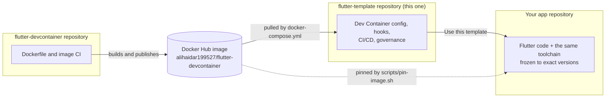

| Repository | Responsibility |
| --- | --- |
| [`flutter-devcontainer`](https://github.com/alihaidar0/flutter-devcontainer) | Builds and publishes the base Docker dev image. A missing or wrong tool in the container is fixed **there**. |
| `flutter-template` (this repository) | Pulls that image; owns the Dev Container config, hooks and app-level CI/CD. |
| Your app | Created from this template; owns the Flutter code. |

**Principles**

- **Blank canvas.** The template never ships Flutter code, flavors or native folders.
- **The template follows the newest, apps freeze.** The template tracks the latest
  image and tooling; each app freezes its own versions
  ([section 9](#9-versions-the-template-follows-the-newest-apps-freeze)).
- **Nothing is installed on your host** except Git, Docker, VS Code and, for
  running the app, an emulator and a browser.
- **Never fail on a fresh template.** CI, builds and hooks detect what exists and
  skip what does not apply.

---

## 2. Create a new app — from zero to the first run

### 2.1 One-time prerequisites (your machine)

| You need | Why | Check |
| --- | --- | --- |
| [Git](https://git-scm.com/) | Clone and commit from the host | `git --version` |
| [Docker Desktop](https://www.docker.com/products/docker-desktop/) (WSL 2 backend on Windows) | Runs the dev container | `docker version` |
| [VS Code](https://code.visualstudio.com/) + the **Dev Containers** extension | Opens the project inside the container | `code --version` |
| An SSH key added to GitHub, and the **ssh-agent** running with the key loaded | `git push` from inside the container ([section 5](#5-git-inside-and-outside-the-container)) | `ssh-add -l`, `ssh -T git@github.com` |
| [Android Studio](https://developer.android.com/studio) with an Android Virtual Device | The emulator the app runs on ([section 8](#8-run-on-your-host-emulator-and-browser)) | Device Manager lists an AVD |
| A browser | The web build opens here | — |

On Windows, start the agent once: see [Git and SSH](#git-and-ssh).

### 2.2 The journey at a glance

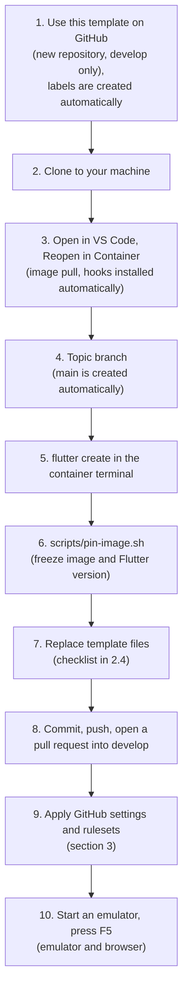

### 2.3 Step by step

**1. Create the repository and its labels.** On the template's GitHub page click
**Use this template → Create a new repository**. Choose the owner and name, and
leave **Include all branches** unchecked. With the GitHub CLI:

```bash
gh repo create OWNER/my_app --template alihaidar0/flutter-template --private --clone
```

The repository's first commit contains `.github/labels.yml`, so the **Labels**
workflow creates every label by itself on the first push. Dependabot opens its
first pull requests within minutes, and the `PR labels` workflow adds labels to
every pull request from its title; both need the labels to exist, so check
**Actions → Labels** (or **Issues → Labels**) before the first pull request. Only
if the labels are missing, run **Actions → Labels → Run workflow**, or
`gh workflow run labels.yml` from the repository.

**2. Clone it** (skip if you used `--clone`). If you use several GitHub accounts
through SSH host aliases, clone with the alias, for example
`git clone git@github.com-work:OWNER/my_app.git`; the container understands it
([section 5](#5-git-inside-and-outside-the-container)).

**3. Open it in the container.** Open the folder in VS Code and click **Reopen in
Container** (or run **Dev Containers: Reopen in Container**). The first start pulls
the image (several GB, once) and then does this without any input:

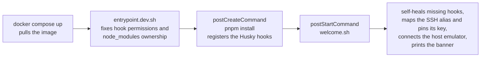

The terminal banner shows the next steps for the current state of the project.

**4. Start a topic branch; `main` is created for you.** The template's default
branch is `develop`, so the new repository starts with `develop` (the
integration branch and the default branch) and no `main`. The **Bootstrap main**
workflow creates `main`, the release branch, from `develop` the first time it is
missing. It starts by itself on the repository's first commit, so `main` appears
within a minute of **Use this template** (check **Actions → Bootstrap main**; if it
did not run, start it with **Run workflow**). You can also create the branch
yourself. All work happens on topic branches:

```bash
git switch -c feat/initial-app        # all work happens on topic branches
```

The workflow never touches an existing `main` and can be deleted afterwards
(it only prints a notice once `main` exists). If it fails, a repository or
organisation policy probably forbids workflows from creating branches: create
it yourself with **Branches → New branch** on GitHub, or
`git push origin develop:main` (the `pre-push` hook allows it while `main` does
not exist yet).

**5. Initialise Flutter** — this is deliberately manual; you choose the
organisation, the name and the platforms:

```bash
flutter create --org com.yourcompany --project-name my_app .
flutter doctor -v                     # Xcode is not expected to be green on Linux
```

`flutter create` only adds files (`lib/`, `test/`, `pubspec.yaml`,
`pubspec.lock`, `analysis_options.yaml`, `android/`, `ios/`, `web/`, `.metadata`);
it changes none of the template's files. It generates no Linux, macOS or Windows
folders because the image has no desktop toolchain.

**Decide the application ID now, before the first commit.** The Android ID is
permanent once the app is published. If the project name contains an underscore
(the usual Dart style, `my_app`), `flutter create` gives Android
`com.yourcompany.my_app` but iOS `com.yourcompany.myApp`, because an iOS bundle
ID cannot contain an underscore. Give both platforms the same, underscore-free
value (for example `com.yourcompany.myapp`): set `applicationId` in
`android/app/build.gradle.kts`, and every `PRODUCT_BUNDLE_IDENTIFIER` in
`ios/Runner.xcodeproj/project.pbxproj` (keep the `.RunnerTests` suffix on the
test target). Leave the Android `namespace` as it is.

**6. Freeze the toolchain:**

```bash
scripts/pin-image.sh
```

It pins the dev image in `docker-compose.yml` to an exact `tag@sha256:digest`,
writes `environment: flutter: <version>` to `pubspec.yaml` and refreshes
`pubspec.lock`, so CI and the builds use exactly what you develop with
([section 9](#9-versions-the-template-follows-the-newest-apps-freeze)).

**7. Write the app's README and replace the other template files** listed in
[2.4](#24-what-to-change-in-the-new-app). The README is generated for you:

```bash
scripts/init-readme.sh --description "One or two sentences about what the app does."
```

It overwrites this guide with a short README for your app: the title (from the
repository name, `--name` overrides it), your description, the CI, Build and License
badges, the platforms `flutter create` made, a Stack table (Flutter, Dart, dev image,
Node, pnpm, Husky and commitlint, read from the project), the template release you
started from, and the license line. It refuses to overwrite a README that is no
longer this guide unless you pass `--force`; run it again after `scripts/pin-image.sh`
if you ran it before, so the Stack table shows the pinned versions.

**8. Commit and push** the scaffold on the topic branch, then open a pull request
**into `develop`**:

```bash
git status                                         # review what flutter create added
git add .
git commit -m "feat(app): add the flutter scaffold"
git push -u origin feat/initial-app
```

The commit goes through the hooks ([section 6](#6-git-hooks-and-pre-commit-checks));
CI on the pull request now runs the full Flutter checks, and `build.yml` produces
the first **staging** artifacts. Merge with **Create a merge commit**.

**9. Configure the GitHub repository** ([section 3](#3-set-up-the-github-repository)):
settings, labels and the rulesets. Do this after the first pull request has run,
because a ruleset can only require a check that has reported once.

**10. Run it** on your emulator and in your browser:

1. Start an emulator on your host (Android Studio → Device Manager).
2. In VS Code press **F5** and pick **Flutter (Emulator + Browser)**.

The app installs on the emulator and opens in your host browser. Details and
fixes: [section 8](#8-run-on-your-host-emulator-and-browser).

### 2.4 What to change in the new app

| File or setting | What to do |
| --- | --- |
| `.github/CODEOWNERS` | Replace `@alihaidar0` with your username or team |
| `.github/dependabot.yml` | Change the `assignees` to you; **uncomment** the `pub` and `docker-compose` blocks (after `flutter create` and `scripts/pin-image.sh`) |
| `LICENSE` | Replace with your license and copyright holder |
| `README.md` | Run `scripts/init-readme.sh` (step 7 above) to replace this guide with your app's README, then extend it |
| `SECURITY.md`, `CONTRIBUTING.md` | Rewrite for your project; they describe the template |
| `CHANGELOG.md` | **Delete** — your changelog is the GitHub Releases page ([section 7](#73-releases-and-the-changelog)) |
| `.env.example` | Replace the sample keys with the ones your app needs (never commit a real `.env`) |
| `pubspec.yaml` `version:` | Keep a semantic version (`1.0.0+1`); raising it in a release pull request publishes a release |
| `docker-compose.yml`, `pubspec.yaml` `environment: flutter:` | Written by `scripts/pin-image.sh`; commit them |
| `package.json` `name` | Optional: rename from `flutter-template` |
| `scripts/welcome.sh` | Optional: change the banner title and link |
| `.github/workflows/image-contract.yml`, `.github/scripts/check-image-contract.sh`, the `release` job of `release.yml`, the `template-guard` job of `ci.yml` | Inert in a project (they only run in the template); delete them if you like |
| `.github/workflows/bootstrap-main.yml` | Creates `main` from `develop` once; delete it after `main` exists (it then only prints a notice) |
| `docs/` | Keep as a reference or delete |
| Template version | `scripts/init-readme.sh` writes the template release you started from into your app's README (the newest on the [template's Releases page](https://github.com/alihaidar0/flutter-template/releases); if you run it later, pass the one from the day you created the app, for example `--template-release v2026.10.04`). Later, that page shows what changed since then ([section 7.3](#73-releases-and-the-changelog)) |
| `lib/`, `test/`, `pubspec.yaml`, `android/`, `ios/`, `web/` | Yours — created by `flutter create`; add packages with `flutter pub add` |
| Application ID (`applicationId` in `android/app/build.gradle.kts`, `PRODUCT_BUNDLE_IDENTIFIER` in `ios/Runner.xcodeproj/project.pbxproj`) | Decide it before the first commit; with an underscore in the project name Android and iOS differ, so set both to the same underscore-free value (step 5 above). The Android ID cannot change after publishing |

Nothing else needs editing: the workflows, hooks, Dev Container and VS Code
configuration work unchanged in a project.

---

## 3. Set up the GitHub repository

Workflows, rulesets as JSON, labels, Dependabot and the templates are copied with
the template; the **repository settings are not**, so every new repository needs the
steps below. The complete reference with every value is in
[`docs/github-setup.md`](docs/github-setup.md).

### 3.1 Bootstrap order

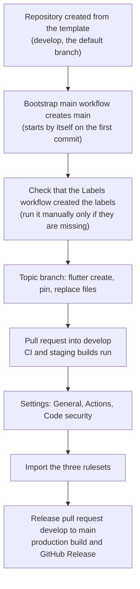

### 3.2 Settings to apply (Settings tab)

| Where | Setting | Value |
| --- | --- | --- |
| General | Default branch | `develop` (so Dependabot security updates and new pull requests target it) |
| General | Template repository | **Off** (on only in `flutter-template` itself) |
| General | Merge commits / squash / rebase | **On** / **Off** / **Off** |
| General | Always suggest updating branches · auto-merge · delete head branches | On · On · On |
| Actions → General | Allowed actions | GitHub-created, plus `raven-actions/actionlint@*`, `zizmorcore/zizmor-action@*`, `google/osv-scanner-action/*` |
| Actions → General | Require actions pinned to a full commit SHA | **On** |
| Actions → General | Workflow permissions | Read repository contents; Actions may **not** create or approve pull requests |
| Actions → General | Fork pull request workflows | Require approval; no secrets or write tokens to forks |
| Code security | Dependency graph, Dependabot alerts and security updates | On |
| Code security | Secret scanning and **push protection** | On |
| Code security | Private vulnerability reporting | On |
| Code security | CodeQL default setup | On, language **Actions** (CodeQL does not cover Dart) |
| Actions → Variables (optional) | `BUILD_IOS` | `true` to add the unsigned iOS compile check |
| Environments (optional) | `production` | Restricted to `main`; holds signing secrets ([`docs/android-signing.md`](docs/android-signing.md)) |

With the GitHub CLI, from the repository root (replace `OWNER/REPO`):

```bash
gh api repos/OWNER/REPO --method PATCH \
  -F allow_merge_commit=true -F allow_squash_merge=false -F allow_rebase_merge=false \
  -F allow_auto_merge=true -F delete_branch_on_merge=true \
  -F has_wiki=false -F has_projects=false -F has_discussions=false
gh label list --limit 50                         # the Labels workflow already created them; if empty: gh workflow run labels.yml
for ruleset in main-protect develop-protect tags-protect; do
  gh api repos/OWNER/REPO/rulesets --method POST --input ".github/rulesets/$ruleset.json"
done
```

### 3.3 What the rulesets enforce

| Ruleset | Targets | Rules |
| --- | --- | --- |
| `main-protect` | `main` | No deletion or force-push; pull request required (merge commits only, conversations resolved); required check **CI passed** |
| `develop-protect` | `develop` | Same, and the branch must be up to date before merging |
| `tags-protect` | `v*` tags | Released tags cannot be moved or deleted |

- The bypass list is **empty**, so the rules apply to administrators too.
- Required approvals are **0** because a solo maintainer cannot approve their own
  pull request. When a second maintainer joins, set `required_approving_review_count`
  to `1` and `require_code_owner_review` to `true`, then import the file again.
- A pull request into `main` from any branch other than `develop` fails **Verify
  source branch**. Rulesets cannot restrict a pull request's source branch, so
  this is enforced in `ci.yml` and made mandatory by the required **CI passed** check.
- Dependabot *security* updates are raised against the default branch, which is
  `develop`, so they arrive like every other update (a repository whose default
  branch is still `main` must re-target them to `develop` by hand).

### 3.4 Check that it works

- `git push origin main` and `git push origin develop` are rejected.
- A pull request from a topic branch into `main` fails **Verify source branch**.
- A pull request from `develop` into `main` offers only **Create a merge commit**.
- A commit message such as `Fixed stuff` fails **Commit messages** in CI.
- A pull request runs **Flutter format**, **analyze**, **test**, **Dependency
  audit** and **Flutter doctor**, and `build.yml` uploads the staging artifacts.

---

## 4. Daily workflow: branches and pull requests

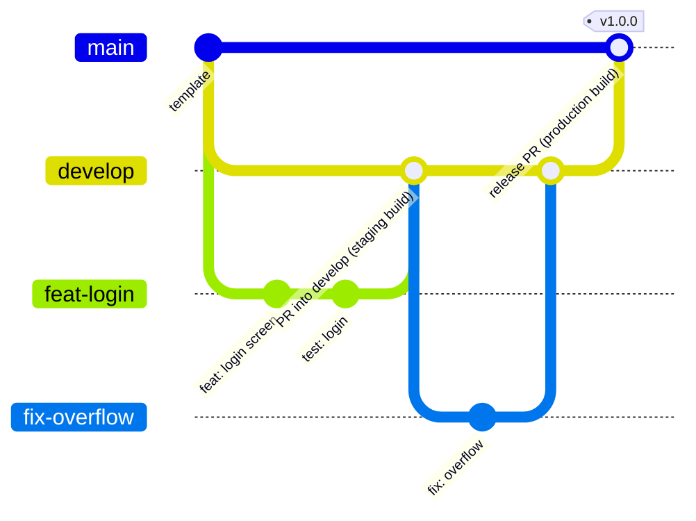

- **`main`** is stable and releasable. **`develop`** is the integration branch
  and the **default branch**: Dependabot pull requests (version and security
  updates) and new pull requests land there. Nobody pushes to either branch
  directly.
- Work on a topic branch named `feat/…`, `fix/…`, `docs/…`, `ci/…`, `chore/…` or
  `deps/…` and open the pull request **against `develop`**.
- Only a `develop` → `main` pull request may target `main`: the **release PR**.
- Always merge with a **merge commit**. Squash and rebase are off because
  squashing into `main` rewrites `develop`'s commits and makes the next release
  conflict.
- Nobody pushes to `develop` or `main` directly; the rulesets enforce it and the
  `pre-push` hook is a local convenience.
- Fill in the pull request template and give the PR a Conventional Commit title:
  the `PR labels` workflow adds the labels that group the release notes
  (`feat` → `feature`, `fix` → `bug`, `docs` → `documentation`, `ci` → `ci`,
  `deps` scope → `dependencies`, `!` → `breaking change`). Add any extra label by hand.

```bash
git switch develop && git pull --ff-only
git switch -c feat/login                       # topic branch
git add path/to/file
git commit -m "feat(auth): add the login screen"
git push -u origin feat/login                  # then open a PR into develop
```

### Commit convention

[Conventional Commits](https://www.conventionalcommits.org/), enforced by
commitlint locally (the `commit-msg` hook) and again in CI for every commit of a
pull request:

```text
feat(auth): add Google Sign-In
fix(home): correct overflow on small screens
chore(deps): bump flutter_riverpod to 2.x
docs(readme): update first steps
test(auth): add unit tests for sign-in flow
refactor(home): extract HomeScreen to separate file
```

**Valid types:** `feat` `fix` `docs` `style` `refactor` `perf` `test` `build` `ci`
`chore` `revert` `wip`. The type is lower-case; the subject is not sentence-, start-,
Pascal- or upper-case and has no trailing period. A change that forces others to
adapt is `feat!:` with a `BREAKING CHANGE:` footer.

---

## 5. Git inside and outside the container

You can use git from the VS Code terminal in the container **or** from a terminal
or GUI on your host, even in the same session.

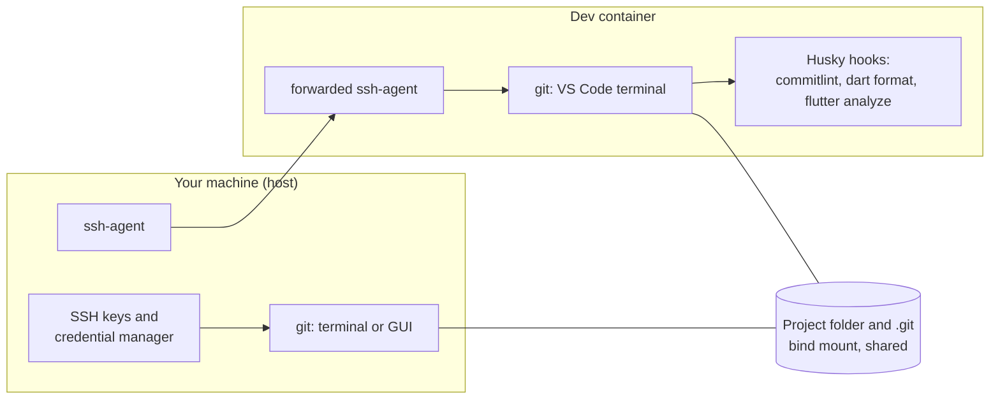

| | In the container | On the host |
| --- | --- | --- |
| Working tree and `.git` | the same folder (bind mount) | the same folder |
| `user.name` / `user.email` | the repository-local setting, otherwise your host `~/.gitconfig` (copied in by VS Code) | the same |
| Authentication | your host **ssh-agent**, forwarded by VS Code; no private key enters the container | your own SSH keys or credential manager |
| Hooks | **run** (commit-msg, pre-commit, pre-push) | **skipped with a notice**, except the push-to-`main`/`develop` block; CI runs the same checks |

### Git and SSH

Neither `~/.gitconfig` nor `~/.ssh` is mounted into the container. VS Code Dev
Containers copies your Git identity in and forwards your host **ssh-agent**, so
`git push` works without a private key ever existing inside the container. Make
sure the agent runs and holds your key *before* opening the folder in the
container:

```powershell
# Windows (once): start the agent automatically, then load your key
sc config ssh-agent start= auto
net start ssh-agent
ssh-add "$env:USERPROFILE\.ssh\id_ed25519"
```

```bash
# macOS / Linux
ssh-add ~/.ssh/id_ed25519
```

Check inside the container with `ssh-add -l` and `ssh -T git@github.com`.

**Several GitHub accounts.** GitHub accepts the first key the agent offers, and
the forwarded agent holds every key you loaded, so without help a push could
authenticate as the wrong account (`Permission to owner/repo.git denied to
<other-account>`). `welcome.sh` therefore runs `scripts/pin-ssh-key.sh` on every
start. When your `origin` remote uses a host alias from your host's `~/.ssh/config`
(for example `git@github.com-work:owner/repo.git`), it finds the key in the agent
that belongs to this repository's account (the only key, else the one GitHub greets
as the repository owner, else the first one that can read it) and writes a `Host`
entry for it in the container's `~/.ssh/config`:

```text
Host github.com-work
  HostName github.com
  User git
  IdentityFile ~/.ssh/github.com-work.pub
  IdentitiesOnly yes
```

This is OpenSSH's documented way to pick one key: `IdentityFile` names the
**public** key (the private half stays in the agent on your host, so nothing secret
enters the container) and `IdentitiesOnly yes` stops ssh from offering the agent's
other keys. If you later switch keys on the host, run `scripts/pin-ssh-key.sh
--force`. Keep `origin` on the alias; do not rewrite it to `https://`.

Only aliases are pinned, because an alias names exactly one account. A plain
`git@github.com:` remote is left alone: pinning `github.com` itself would apply to
every repository the container fetches (other accounts' private repositories,
submodules). With several accounts, use an alias for the project's remote, or load
only that account's key on the host.

**Choosing the key yourself.** The automatic choice is a guess: when two of your
accounts can read the same repository (an organisation), it takes the first one that
can, and some agents ask you to approve every key it tries. To choose the key
explicitly, list the fingerprints and pin one:

```bash
ssh-add -l                                  # 256 SHA256:AbC... you@example.com (ED25519)
scripts/pin-ssh-key.sh --key SHA256:AbC...  # pins exactly that key, nothing is probed
```

The fingerprint is public. It is remembered in this clone's `.git/config`
(`devcontainer.sshkey`), so it survives container rebuilds and is not tracked. If that
key is not in the agent the script says so and pins nothing, instead of falling back
to another account's key. Go back to the automatic choice with `git config --unset
devcontainer.sshkey`.

**Identity.** Check what a commit will use, and set it for this repository only
(never `--global`) if needed; it applies on both sides:

```bash
git config user.name
git config user.email
git config --show-origin --get user.email   # which file the email comes from
git config user.email "you@example.com"
```

Agent forwarding works through VS Code (or the `devcontainer` CLI), not through a
plain `docker compose exec` shell.

---

## 6. Git hooks and pre-commit checks

Husky v9 registers the hooks when the container is created (`postCreateCommand`
runs `pnpm install`). `welcome.sh` repeats the install on every start if the hooks
are missing (an interrupted first start, a recreated volume), so the very first
commit and push of a new project are already checked.

| Hook | When | What it does |
| --- | --- | --- |
| `commit-msg` | every `git commit` | commitlint: the message must be a Conventional Commit |
| `pre-commit` | every `git commit` | `dart format --set-exit-if-changed` on the **staged Dart files only** — fast; skipped until `pubspec.yaml` exists |
| `pre-push` | every `git push` | blocks pushing to `main` and `develop`; runs `flutter analyze --fatal-infos` (the same command as CI) before commits leave your machine (skipped without `pubspec.yaml`, and when only branches are deleted) |

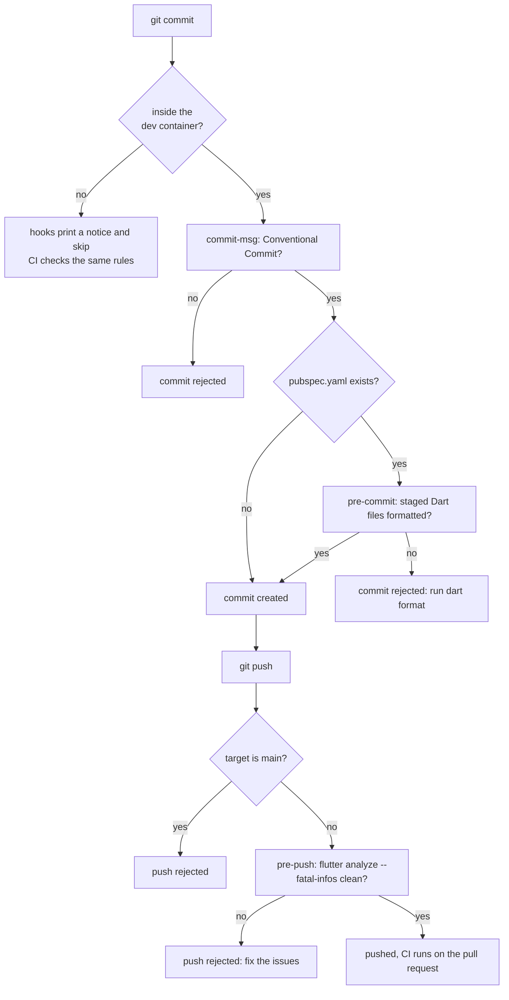

- The toolchain-dependent hooks need Node, pnpm and Flutter, which live in the
  container; on the host they skip with a notice, and **CI re-checks the commit
  messages, formatting and analysis of every pull request**, so nothing slips
  through. The block on pushing to `main` and `develop` works everywhere (it
  applies once the branch exists on the remote, so creating it still works).
- Hooks are small shell scripts in `.husky/`; `entrypoint.dev.sh` restores their
  execute bit on every container start because Windows strips it.
- A hook is a local convenience; the GitHub rulesets and **CI passed** are the real gate.

---

## 7. CI/CD: checks, builds and releases

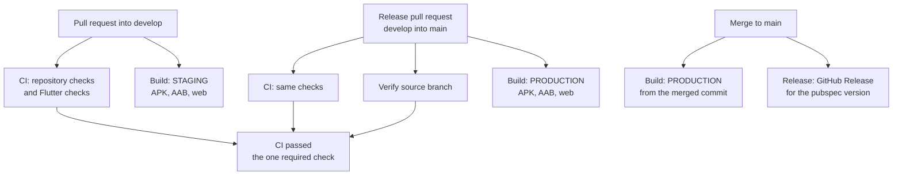

### 7.1 `ci.yml` — pull request checks

Runs on every pull request into `develop` or `main` (and on demand), in **three
tiers** so it never fails on a fresh template:

| Tier | Condition | What runs |
| --- | --- | --- |
| 1 | No `pubspec.yaml` | Repository checks only; every Flutter job is skipped and CI passes |
| 2 | `pubspec.yaml`, no `pubspec.lock` | Repository checks + `flutter doctor` |
| 3 | `pubspec.yaml` + `pubspec.lock` | Everything: format, analyze, test, coverage, audit, doctor |

Repository checks (every tier):

- **Verify source branch** — a pull request into `main` must come from `develop`.
- **Lint** — ShellCheck for the scripts and hooks; actionlint and zizmor for the workflows.
- **Format** — LF endings, no trailing whitespace, final newline (the last two
  skip `android/`, `ios/`, `web/`, `macos/`, `linux/` and `windows/`, which
  `flutter create` writes).
- **Commit messages** — every commit of the pull request is a Conventional Commit.
- **Node dependency audit** — `pnpm audit` on the lock file; high and critical fail.
- **Template guard** — template repository only (blank canvas, executable scripts).

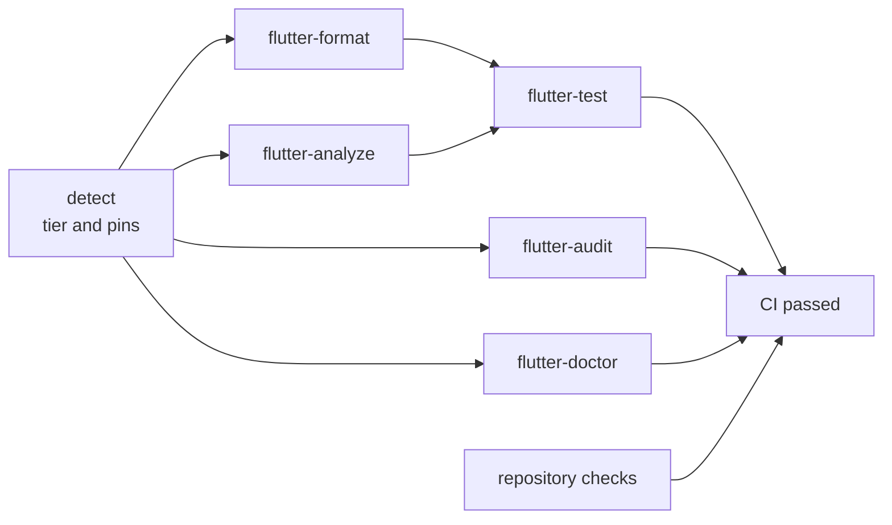

| Flutter job | Command | Purpose |
| --- | --- | --- |
| `flutter-format` | `dart format --set-exit-if-changed .` | Formatting |
| `flutter-analyze` | `flutter pub get --enforce-lockfile`, `flutter analyze --fatal-infos` | Static analysis and lints |
| `flutter-test` | `flutter test --coverage` | Unit and widget tests (skipped without `test/`) |
| `flutter-audit` | OSV-Scanner on `pubspec.lock` | Known vulnerabilities (Dart has no built-in audit) |
| `flutter-doctor` | `flutter doctor -v` | Environment sanity |

**CI passed** is the single required status check. It always runs, fails if any
job failed or was cancelled, and passes when jobs were skipped by design. Flutter
jobs install the version pinned in `pubspec.yaml`; until the image and Flutter are
pinned CI prints a warning (never a failure). Every job has least-privilege
`permissions:` and a timeout, and every action is pinned to a full commit SHA.

### 7.2 `build.yml` — staging and production builds

| Trigger | Environment | Artifacts (retention) |
| --- | --- | --- |
| Pull request into `develop` | `staging` | `android-apk-staging`, `android-aab-staging`, `web-build-staging` (14 days) |
| Pull request into `main` (the release PR) | `production` | `android-apk-production`, `android-aab-production`, `web-build-production` (30 days) |
| Push to `main` (the merged release) | `production` | same names, built from the merged commit |
| Manual run (**Actions → Build → Run workflow**) | `staging` or `production` | same names |

Every build runs `flutter build <target> --release --dart-define=APP_ENV=<environment>`
and, if the project has `env/<environment>.json`, adds
`--dart-define-from-file=env/<environment>.json`. Read the value in Dart with
`const appEnv = String.fromEnvironment('APP_ENV');`. Draft pull requests are not
built; the workflow only runs when Flutter source, assets, `env/`, `pubspec.*` or
the native folders change, and it skips entirely until `pubspec.yaml` and
`pubspec.lock` exist. The production build runs on both the release pull request
(proof the release compiles) and the merge (the artifact to ship, traceable to one
commit on `main`).

Nothing is signed or deployed: release builds without a signing configuration use
the debug key, so the artifacts are for testing. To sign the production App Bundle
for the Play Store follow [`docs/android-signing.md`](docs/android-signing.md);
deployment (Play Store, Firebase App Distribution, a web host) and flavors
([7.5](#75-flavors-optional-per-app)) are added per project.

**iOS (opt-in).** macOS runners cost more minutes on private repositories, so the
iOS job is off until the repository variable `BUILD_IOS` is `true`
(**Settings → Secrets and variables → Actions → Variables**). It then runs
`flutter build ios --release --no-codesign` on `macos-15` and uploads
`ios-app-<environment>`: an unsigned compile check, not an installable app.

### 7.3 Releases and the changelog

`release.yml` runs when `main` changes and publishes a GitHub Release with
**generated notes**, grouped by pull-request label (`.github/release.yml`). The
Releases page is the changelog; nothing is committed back to a protected branch, so
no bot, token or extra pull request is involved.

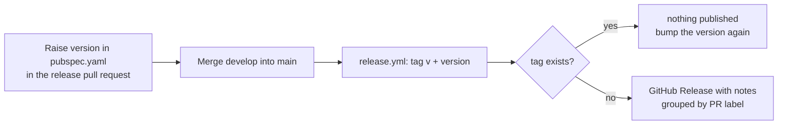

- **In a project** the tag is the `pubspec.yaml` version without the build number
  (`version: 1.4.0+7` releases `v1.4.0`). A version is released once; a suffix
  (`2.0.0-beta.1`) marks a pre-release. Labels (`feature`, `bug`,
  `breaking change`, `documentation`, …) are added automatically from the pull
  request title by `pr-labels.yml` (a `develop` → `main` promotion gets
  `skip-changelog`); add or remove one by hand to override, and use
  `skip-changelog` to leave a pull request out.
- **In the template** the tag is the calendar date (`vYYYY.MM.DD`).
  An app created from the template does not carry its history, so the tag is not
  recorded for you: to see what changed in the toolchain (hooks, workflows,
  Dev Container) since you started, open the
  [template's Releases page](https://github.com/alihaidar0/flutter-template/releases)
  and read the releases newer than the one you noted in your README.
- Tags `v*` are immutable (`tags-protect`).

**Cut a release:** open the pull request `develop` → `main` titled
`release: <summary>`, raise `version:` in `pubspec.yaml`, wait for **CI passed**
and the production build, and merge with a merge commit.

### 7.4 Dependabot

Weekly updates (Monday 09:00 UTC) open pull requests against **`develop`**, grouped,
with a 7-day cooldown so a freshly published (possibly compromised) release is
never proposed immediately.

| Ecosystem | Scope | Notes |
| --- | --- | --- |
| `github-actions` | All Actions versions | One weekly group |
| `npm` | Husky and commitlint | Node 24 frozen — moved manually together with the image |
| `pub` | Dart packages | **Commented out** in the template (needs a `pubspec.yaml`); uncomment in a project |
| `docker-compose` | The dev image | **Commented out**; uncomment after `scripts/pin-image.sh` |

### 7.5 Flavors (optional, per app)

The template separates staging from production with **compile-time configuration**
(`--dart-define=APP_ENV` and an optional `env/<environment>.json`), which is
enough for most apps and needs no native changes. It does **not** ship Flutter
**flavors**: they live in `android/` and `ios/`, which only exist after
`flutter create`, and the template stays a blank canvas. Add flavors in an app when
you need what configuration alone cannot give:

| You need | `APP_ENV` / `env/*.json` | Flavors |
| --- | --- | --- |
| Different API URL, keys or feature flags per environment | Yes | Yes |
| Staging and production installed **side by side** on one device (different app IDs) | No | Yes |
| A different app name or icon per environment | No | Yes |
| A separate Firebase project per environment (one `google-services.json` or plist per flavor) | Only by switching config in code | Yes |

Flavors apply to Android and iOS (and macOS); **`flutter build web` has no flavor
support.** To adopt them, name the flavors after the environments so one name
drives everything:

1. **Define `staging` and `production` flavors** following the official
   [Flutter flavors guide](https://docs.flutter.dev/deployment/flavors) (Gradle
   `productFlavors` for Android; schemes and build configurations for iOS). For
   example, in `android/app/build.gradle.kts`:

   ```kotlin
   android {
       flavorDimensions += "environment"
       productFlavors {
           create("staging") {
               dimension = "environment"
               applicationIdSuffix = ".staging"
           }
           create("production") {
               dimension = "environment"
           }
       }
   }
   ```

2. **Pass the flavor in `build.yml`.** In the `Build release` step of the `build`
   job, add the flag for the Android targets only:

   ```bash
   if [[ "$TARGET" != "web" ]]; then
     args+=(--flavor "$APP_ENV")
   fi
   ```

   Do the same in the `Build iOS` step if you enable `BUILD_IOS`.

3. **Update the artifact paths.** With flavors the outputs move, for example
   `build/app/outputs/flutter-apk/app-staging-release.apk` and
   `build/app/outputs/bundle/stagingRelease/app-staging-release.aab`. Run
   `flutter build apk --flavor staging` once in the container, check the printed
   path, and set the matrix `path:` values in `build.yml` accordingly (the artifact
   upload fails loudly if a path is wrong).

4. **Run it locally.** Add `"args": ["--flavor", "staging"]` to the **Flutter
   (Android — host emulator)** configuration in `.vscode/launch.json`, or run
   `flutter run --flavor staging -d host.docker.internal:5555`.

Keep `APP_ENV` as well: flavors change the app's identity and native resources,
while the dart-defines keep driving configuration in Dart.

---

## 8. Run on your host: emulator and browser

The container has no screen, so your app runs on the **emulator and browser of your
host machine**, with nothing to configure per project. Start an emulator on the
host (Android Studio → Device Manager), then in VS Code press **F5** and pick:

| Launch configuration | What happens |
| --- | --- |
| **Flutter (Emulator + Browser)** | Both of the below at once; stopping one stops both |
| **Flutter (Android — host emulator)** | Connects the container to the emulator, installs and runs the app; hot reload (`r`) and hot restart (`R`) work |
| **Flutter (Web — host browser)** | Serves the app on port 8080 inside the container; VS Code forwards the port and opens it in your host browser |

From a terminal the equivalents are `flutter run -d host.docker.internal:5555` and
`frunw`. Web needs no emulator, adb or firewall setup, which makes it the fastest
loop when Android-specific behaviour is not what you are testing.

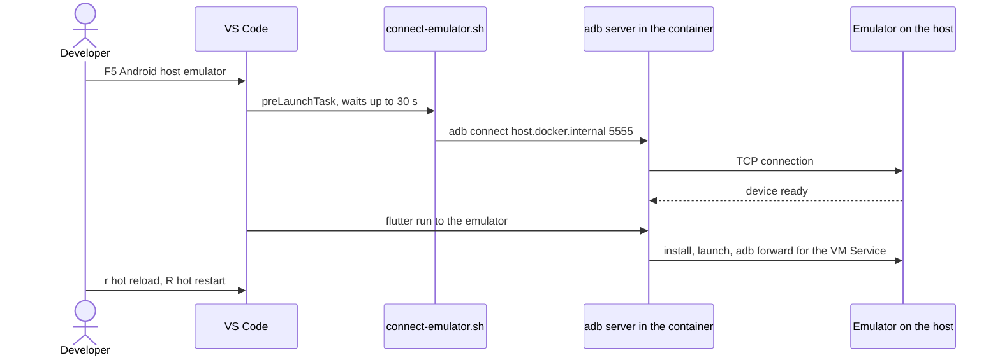

**How the emulator connects.** The container runs its **own** `adb` server and
connects *out* to the emulator (`adb connect host.docker.internal:5555`).
`scripts/connect-emulator.sh` does that at container start and again before each
Android launch, so it does not matter whether the emulator or the container started
first. The host's own `adb` server is deliberately not used: with a remote `adb`
server the port forward Flutter needs for hot reload would be bound on the host,
out of reach of `flutter run` in the container, and the app would hang on
"Connecting to the VM Service...".

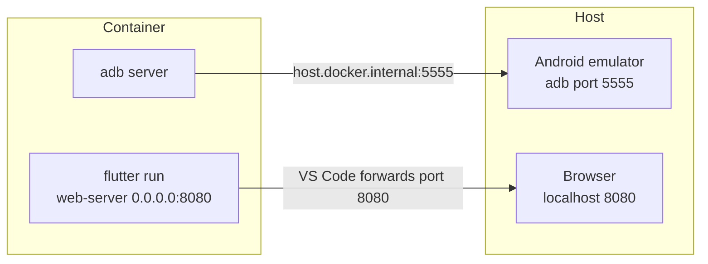

### One-time host setup

1. Install Android Studio and create an Android Virtual Device.
2. Only if the connection is refused (Windows Firewall blocks the container's
   virtual network by default), allow the emulator's adb ports once, in an
   **administrator** PowerShell:

```powershell
New-NetFirewallRule -DisplayName "Docker ADB Emulator Access" -Direction Inbound -Protocol TCP -LocalPort 5555,5557,5559 -Action Allow
```

`5555` is the first emulator's adb port; further emulators use `5557`, `5559`.

### Emulator troubleshooting

Run `scripts/connect-emulator.sh` by hand to see what it finds, then:

- **`unauthorized`** — the emulator shows an "Allow USB debugging?" prompt. Click
  **Allow**, then run the script again.
- **`offline`** — run `adbrestart` (`adb kill-server && adb start-server`), then the script again.
- **`Connection refused` / no device** — the emulator is not fully booted yet, or
  the firewall rule above is missing.

---

## 9. Versions: the template follows the newest, apps freeze

The template follows the newest of everything: `docker-compose.yml` pulls
`flutter-devcontainer:latest`, CI uses the newest stable Flutter, and Dependabot
keeps Actions and the Node tooling current. An app created from it should do the
opposite and change only when you decide. Everything that can move is frozen per app:

| What | Frozen by | How |
| --- | --- | --- |
| Dev image (Flutter, Dart, Java, Node, Android SDK) | `<tag>@sha256:<digest>` in `docker-compose.yml` | `scripts/pin-image.sh` once; run it again to move to a newer build |
| Flutter in CI and builds | `environment: flutter: X.Y.Z` in `pubspec.yaml` | `scripts/pin-image.sh` writes it (run it after `flutter create`) |
| Dart packages | `pubspec.lock` | Committed by `flutter pub get`; CI and builds run `flutter pub get --enforce-lockfile` and fail if the lock file is out of sync |
| Node tooling (Husky, commitlint, pnpm) | exact versions in `package.json`, `pnpm-lock.yaml` | Already exact; CI installs with `--frozen-lockfile` |
| GitHub Actions | full commit SHAs in the workflows | Already pinned |

After pinning, enable the `pub` and `docker-compose` blocks in
`.github/dependabot.yml`: updates then arrive as pull requests you review (with a
7-day cooldown), never silently. To move an app to a newer toolchain run
`scripts/pin-image.sh` again (it picks the newest `flutter-X.Y.Z.R` of the Flutter in
your container; pass a tag, or `latest` for the newest build, to choose another),
rebuild the container, run the script once more so `pubspec.yaml` follows the new
Flutter, and commit the change. A Dependabot image pull request changes only
`docker-compose.yml`: update `environment: flutter:` in the same pull request.

### Updating the dev image

A named volume is filled from the image only when it is first created. After
pulling a newer image, recreate the container and its volumes:

```bash
docker compose pull && docker compose down -v
```

Then use **Dev Containers: Rebuild Container**. `down -v` also clears the pub,
Gradle and `node_modules` volumes, so the first build afterwards downloads
dependencies again.

### Named Volumes

Named volumes keep caches between container rebuilds; without them every rebuild
re-downloads all Flutter packages and Gradle dependencies (~4–5 GB combined).

| Volume | Path in container | Purpose |
| --- | --- | --- |
| `pub-cache` | `/home/developer/.pub-cache` | Dart/Flutter package cache |
| `gradle-cache` | `/home/developer/.gradle` | Gradle dependency cache |
| `node-modules` | `/workspace/node_modules` | Husky and commitlint, kept off the slow bind mount |
| `shell-history` | `/home/developer/.shell_history` | Bash history across rebuilds |

The Android SDK is not a volume: it ships in the image, and a volume would keep an
old copy after you pull a newer image. `node_modules` is a volume because reading
its thousands of small files through a Windows or macOS bind mount is slow:
measured with this template, the commit-message check took 9.2 s on the bind mount
and 0.55 s on a volume, on every commit. The container creates an empty
`node_modules` folder in your project directory as the mount point; it is ignored
by Git and nothing on the host uses it.

---

## 10. Reference

### Repository structure

```text
flutter-template/
├── .devcontainer/
│   └── devcontainer.json             ← VS Code dev container config
├── .github/
│   ├── actions/
│   │   └── setup-flutter/            ← installs Flutter in CI (checksum verified, cached, SHA-pinned)
│   ├── ISSUE_TEMPLATE/               ← bug report and feature request forms
│   ├── rulesets/                     ← importable rulesets: main, develop, v* tags
│   ├── scripts/
│   │   └── check-image-contract.sh   ← compares the template with the dev image
│   ├── workflows/
│   │   ├── bootstrap-main.yml        ← creates main from develop in a new project (never in the template)
│   │   ├── build.yml                 ← staging (PR → develop) and production (PR/merge → main) builds
│   │   ├── ci.yml                    ← pull request validation → "CI passed"
│   │   ├── image-contract.yml        ← weekly template ↔ image check (template repo only)
│   │   ├── labels.yml                ← syncs labels.yml to GitHub
│   │   ├── pr-labels.yml             ← labels a pull request from its title
│   │   ├── release.yml               ← GitHub Releases with generated notes
│   │   └── setup-flutter-test.yml    ← smoke test of the setup-flutter action (runs only when it changes)
│   ├── CODE_OF_CONDUCT.md
│   ├── CODEOWNERS
│   ├── PULL_REQUEST_TEMPLATE.md
│   ├── dependabot.yml                ← Actions + npm (pub and docker-compose for projects), PRs → develop
│   ├── labels.yml
│   ├── release.yml                   ← release-notes categories (by PR label)
│   └── zizmor.yml                    ← workflow security linter settings
├── .husky/
│   ├── commit-msg                    ← Conventional Commits
│   ├── pre-commit                    ← format check of staged Dart files
│   └── pre-push                      ← blocks main and develop, runs flutter analyze
├── .vscode/
│   ├── extensions.json               ← recommends Dev Containers
│   ├── launch.json                   ← host emulator, host browser, both
│   ├── settings.json                 ← shared editor settings
│   └── tasks.json                    ← "Connect host emulator"
├── docs/
│   ├── android-signing.md            ← Play Store signing (per project)
│   └── github-setup.md               ← every GitHub setting, step by step
├── scripts/
│   ├── connect-emulator.sh           ← connects adb to the host emulator
│   ├── entrypoint.dev.sh             ← fixes hook permissions and volume ownership on start
│   ├── init-readme.sh                ← replaces this guide with the README of an app
│   ├── pin-image.sh                  ← freezes the image and Flutter version of an app
│   ├── pin-ssh-key.sh                ← pins the SSH key of the repository's GitHub account
│   └── welcome.sh                    ← banner, hook self-heal, SSH key pin, adb connect
├── .editorconfig · .env.example · .gitattributes · .gitignore
├── CHANGELOG.md · CONTRIBUTING.md · LICENSE · README.md · SECURITY.md
├── commitlint.config.mjs
├── docker-compose.yml                ← starts the container, mounts the project and caches
├── package.json · pnpm-lock.yaml · pnpm-workspace.yaml   ← Husky + commitlint only
└── repomix.config.json               ← single-file repository snapshot config
```

### What's included

| Path | Purpose |
| --- | --- |
| `.devcontainer/devcontainer.json` | Dev container config: pre-built image, forwards port 8080, installs extensions, declares Codespaces host requirements |
| `docker-compose.yml` | Starts the container, mounts the project and named volumes, resolves the host gateway |
| `scripts/*.sh` | Entrypoint, banner and hook self-heal, emulator connection, image pinning, SSH key pinning, app README generation |
| `.husky/*`, `commitlint.config.mjs` | The git hooks and the commit rules |
| `package.json`, `pnpm-lock.yaml` | Husky + commitlint only — no app dependencies; Node ≥ 24; pnpm equal to the version the image pre-caches |
| `.github/workflows/*` | CI, builds, releases, labels (synced and set from the PR title), the weekly image contract check |
| `.github/rulesets/`, `.github/dependabot.yml`, `.github/labels.yml`, `.github/release.yml`, `.github/CODEOWNERS` | Governance as files |
| `.github/PULL_REQUEST_TEMPLATE.md`, `.github/ISSUE_TEMPLATE/`, `.github/CODE_OF_CONDUCT.md`, `SECURITY.md`, `CONTRIBUTING.md` | Community files |
| `docs/` | GitHub settings guide and Android signing guide |
| `.vscode/*` | Shared editor settings and the run/debug configurations |
| `.env.example`, `.editorconfig`, `.gitattributes`, `.gitignore`, `LICENSE`, `CHANGELOG.md`, `repomix.config.json` | Supporting files |

**Not included** (add per project): state management, routing, HTTP, storage and
Firebase packages (`flutter pub add <package>`), deployment workflows (targets
vary), Android signing keys, flavors ([7.5](#75-flavors-optional-per-app)) and iOS signing.

### Shell Aliases

All aliases are baked into the base image by `flutter-devcontainer`. A quick reference:

| Alias          | Expands to                                                          |
| -------------- | ---------------------------------------------------------------------- |
| `fl`           | `flutter`                                                            |
| `frun`         | `flutter run`                                                        |
| `frunw`        | `flutter run -d web-server --web-port 8080 --web-hostname 0.0.0.0`  |
| `ftest`        | `flutter test`                                                       |
| `ftestc`       | `flutter test --coverage`                                            |
| `fanalyze`     | `flutter analyze`                                                    |
| `fformat`      | `dart format .`                                                      |
| `fformatcheck` | `dart format --set-exit-if-changed .`                                |
| `fdoctor`      | `flutter doctor -v`                                                  |
| `fclean`       | `flutter clean`                                                      |
| `fcreate`      | `flutter create`                                                     |
| `fget`         | `flutter pub get`                                                    |
| `fadd`         | `flutter pub add`                                                    |
| `fbuildapk`    | `flutter build apk --release`                                        |
| `fbuildaab`    | `flutter build appbundle --release`                                  |
| `fbuildweb`    | `flutter build web --release`                                        |
| `adbdevices`   | `adb devices`                                                        |
| `adbrestart`   | `adb kill-server && adb start-server`                                |
| `gs`           | `git status`                                                         |
| `ga`           | `git add`                                                             |
| `gc`           | `git commit -m`                                                      |
| `gp`           | `git push`                                                            |
| `gl`           | `git log --oneline --graph --decorate`                               |

### Platform Support

| Platform | Build target | Status |
| --- | --- | --- |
| Android APK | `flutter build apk` | Included in `build.yml` (staging and production) |
| Android AAB | `flutter build appbundle` | Included in `build.yml` (staging and production) |
| Web | `flutter build web` | Included in `build.yml` (staging and production) |
| iOS | `flutter build ios` | Opt-in unsigned compile check in `build.yml` (`BUILD_IOS`); signing per project; the Simulator can't run in this Linux container |
| macOS Desktop | `flutter build macos` | Add per project — requires a `macos` runner |
| Linux Desktop | `flutter build linux` | Not included — the dev image ships no Linux desktop toolchain |
| Windows Desktop | `flutter build windows` | Add per project — requires a `windows` runner |

### Dev Image

|               |                                                                                                                                                    |
| --------------- | ---------------------------------------------------------------------------------------------------------------------------------------------------- |
| **Image**     | `alihaidar199527/flutter-devcontainer:latest`                                                                                                       |
| **Source**    | [`github.com/alihaidar0/flutter-devcontainer`](https://github.com/alihaidar0/flutter-devcontainer)                                                  |
| **Platforms** | `linux/amd64` · `linux/arm64`                                                                                                                        |
| **Tags**      | `latest` (moves with every build) · `flutter-X.Y.Z.R` (`X.Y.Z` = Flutter release, `R` = image revision; permanent, never changed or deleted) — the images are signed (see the image repository for the `cosign verify` command); run `scripts/pin-image.sh` in each project to pin the newest `flutter-X.Y.Z.R` and its digest |
| **Contents**  | Flutter (stable) · Dart · Android SDK 36 · Java 21 (Temurin) · Node.js 24 LTS · Firebase CLI · FlutterFire CLI · Chromium + chromedriver · GitHub CLI · Starship |

---

## 11. Troubleshooting

### `git push` fails — permission denied (publickey)

Keys come from your host's ssh-agent (see [Git and SSH](#git-and-ssh)). Inside the container:

```bash
ssh-add -l            # the agent must list your key; empty = nothing forwarded
ssh -T git@github.com # verify authentication
```

If the list is empty, start the agent and `ssh-add` your key on the host, then
reload the VS Code window.

### `git push` fails — `denied to <another-account>`

The agent holds keys of several accounts and ssh used the wrong one. The container
pins the right key on every start (see [Git and SSH](#git-and-ssh)). If the start
printed a notice that it could not tell which key belongs to the repository, or it
pinned the wrong one, choose the key yourself (`ssh-add -l` lists the fingerprints):

```bash
scripts/pin-ssh-key.sh --key SHA256:...
cat ~/.ssh/config          # the Host entry must show IdentityFile and IdentitiesOnly yes
ssh -T git@<host-of-origin>  # "Hi <account>!" must name the repository's account
```

### Commit rejected — invalid commit message

Use one of the valid types (`feat fix docs style refactor perf test build ci chore
revert wip`), for example `feat(home): add bottom navigation bar`.

### Commit rejected — Dart files are not formatted

Run `dart format .` (or `fformat`), stage the files again and commit.

### Push rejected — `flutter analyze` reported issues

Run `flutter analyze --fatal-infos` (the hook and CI use this flag, so info-level
lints fail too; the `fanalyze` alias leaves it out), fix what it reports and push
again.

### Git hooks do not run

Run `pnpm install` inside the container. `welcome.sh` also re-installs them on
every container start. On the **host** the hooks skip on purpose
([section 5](#5-git-inside-and-outside-the-container)).

### Flutter not found after container start

The `developer` user's PATH is set in the base image. If aliases are missing,
reload the shell with `source ~/.bashrc`.

### Port 8080 not forwarding

VS Code auto-forwards port 8080. If the browser does not open, check the **Ports**
tab in VS Code and open `http://localhost:8080` manually.

### `pnpm install` fails — wrong pnpm version

`package.json` requires Node ≥ 24 and pins pnpm through `packageManager`. The image
prepares exactly that version, so a failure usually means `packageManager` differs
from the image's pnpm (Corepack then tries to download the other one) or the command
ran on your host instead of in the container. Check `pnpm -v` and run
`docker compose pull && docker compose down -v` if the image is old.

### Container start prints a permissions warning

On some hosts (Windows with Docker Desktop bind mounts) the start banner may show
`Warning: could not fix … permissions … Continuing anyway.` `entrypoint.dev.sh`
treats this as non-fatal. If a Husky hook then does not run, make it executable
with `chmod +x .husky/*` and run `pnpm install`.

### The emulator is not found

Run `scripts/connect-emulator.sh` and follow its hints, or see
[Emulator troubleshooting](#emulator-troubleshooting).

### Windows: shell scripts fail with `\r: command not found`

`.gitattributes` enforces LF endings. If you cloned before it was in place,
renormalise the repository:

```bash
git rm --cached -r .
git reset --hard HEAD
```

### CI shows warnings "Flutter is not pinned" or "Dev image is not pinned"

Run `scripts/pin-image.sh`, commit `docker-compose.yml`, `pubspec.yaml` and
`pubspec.lock`.

---

## 12. Maintaining the template itself

This section is for changing `flutter-template`, not for using it. Read
[`CONTRIBUTING.md`](CONTRIBUTING.md) first; the rules that matter most:

- **Stay a blank canvas.** No `lib/`, `pubspec.yaml`, `android/`, `ios/`, `web/` or
  `test/` — the **Template guard** fails CI if they appear.
- **Every file here is copied into every project.** A change must work on the
  empty template (Tier 1) and on a real app (Tier 3); template-only jobs carry
  `if: github.event.repository.is_template`.
- **The required check is the job named exactly `CI passed`.** Renaming it breaks
  branch protection. New jobs get a tier condition and join its `needs:`.
- **Hooks and scripts are LF and executable in Git** (mode `100755`; for a new file
  `git add --chmod=+x <file>`).
- **The dev image is a separate repository.** If a tool is missing or wrong in the
  container, fix it in `flutter-devcontainer`. The weekly **Image contract** run
  compares pnpm, Node, the image name and the documented aliases and turns red when
  the two repositories drift.
- **Workflow hygiene:** actions pinned to a full SHA with a `# vX.Y.Z` comment,
  `permissions: contents: read` by default, `persist-credentials: false`,
  `timeout-minutes` on every job, `${{ }}` reaching `run:` only through `env:`.
- **Keep this README true** and add template-level changes to `CHANGELOG.md`.

Local checks before opening a pull request:

```bash
bash -n scripts/*.sh
docker run --rm -v "$PWD:/mnt" -w /mnt koalaman/shellcheck:v0.9.0 scripts/*.sh .github/scripts/*.sh
docker run --rm -v "$PWD:/repo" -w /repo rhysd/actionlint:latest -no-color
docker run --rm -v "$PWD:/repo:ro" -w /repo ghcr.io/zizmorcore/zizmor:latest --no-progress --offline .
docker compose config --quiet
```

---

## License

MIT — see [`LICENSE`](LICENSE).

## Security

Found a vulnerability? Do not open a public issue — see [`SECURITY.md`](SECURITY.md)
for private reporting instructions.

## Related repositories

| Repo | Purpose |
| --- | --- |
| [`flutter-devcontainer`](https://github.com/alihaidar0/flutter-devcontainer) | Builds and publishes the base Docker dev image |
| [`flutter-template`](https://github.com/alihaidar0/flutter-template) | You are here — GitHub Template for every new Flutter project |

---

_Flutter stable · Dart · Android SDK 36 · Java 21 Temurin · Node.js 24 LTS · Husky 9 · commitlint 21 · MIT · 2026_
